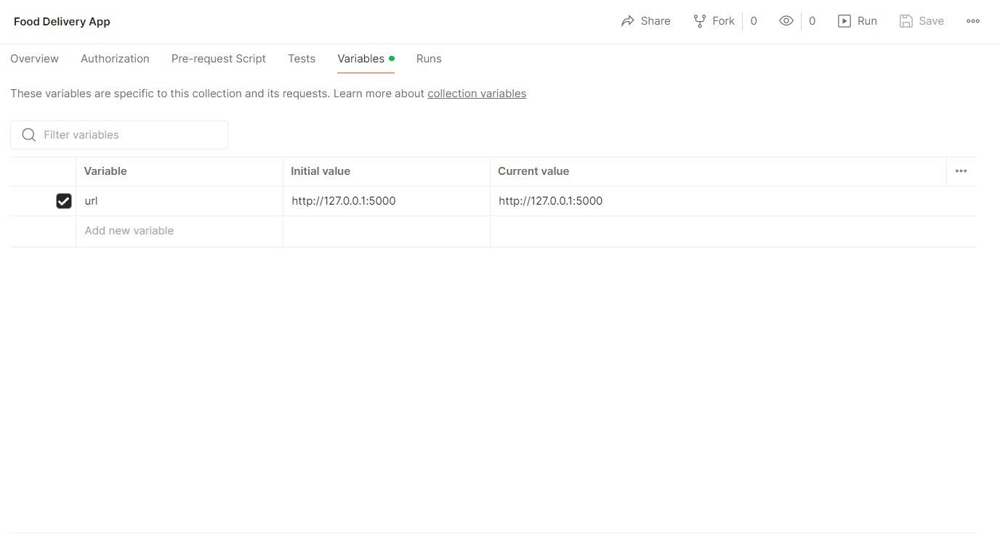
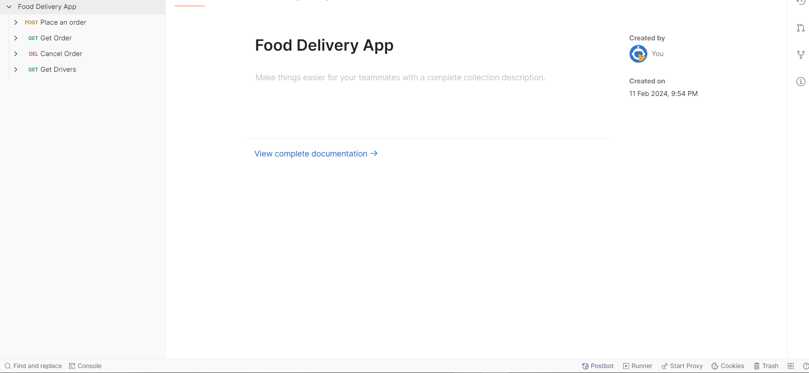
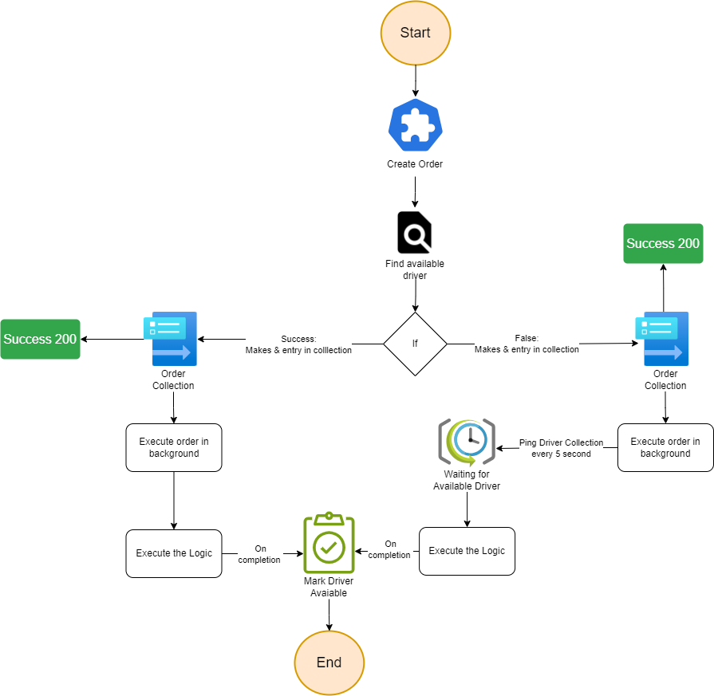

# Food Delivery app Setup Guide & API Documentation

## Clone the Repository

Clone this repository to your local machine:

```bash
git clone {REPO_URL}
```

## Installation With docker

```bash
docker-compose up
```

## Installation Without docker

### Install Python

Before proceeding, make sure you have Python installed on your system. You can download and install the latest version of Python from the [official Python website](https://www.python.org/downloads/).

### Install Required Packages

```bash
cd server
pip install -r requirements.txt
```

### Default Mongo DB URL

#### Url can be recplaced in .env file

```bash
MONGODB_URI=mongodb://localhost:27017/order-tracker
```

### Serving

```bash
python app.py
```

## Import Postman Collection to run

#### Paste your serving url in collection variable



#### You will find all the api inside the collections



# High-level Flow Chart



### The following API allows users to place orders, retrieve order details, and cancel orders.

## Endpoints

### Place Order

- **URL:** `/place_order`
- **Method:** `POST`
- **Description:** Creates a new order and assigns an available driver if found, otherwise queues the order for future assignment.
- **Request Body:** None
- **Response:**
  - Success: Returns JSON with order details and assigned driver if available.
  - Failure: Returns appropriate error message.

---

### Get Order Details

- **URL:** `/order/<order_id>`
- **Method:** `GET`
- **Description:** Retrieves details of a specific order identified by its ID.
- **Request Parameters:**
  - `order_id` (string): Unique identifier for the order.
- **Response:**
  - Success: Returns JSON with order details.
  - Failure: Returns appropriate error message if the order is not found.

---

### Cancel Order

- **URL:** `/order/<order_id>`
- **Method:** `DELETE`
- **Description:** Cancels a pending order. If the order is already completed, returns an error message.
- **Request Parameters:**
  - `order_id` (string): Unique identifier for the order.
- **Response:**
  - Success: Returns a message confirming the cancellation of the order.
  - Failure: Returns appropriate error message if the order is not found or already completed.

---

### Get Drivers

- **URL:** `/drivers`
- **Method:** `GET`
- **Description:** Retrieves the list of available drivers.
- **Response:**
  - Success: Returns JSON with the list of available drivers.
  - Failure: Returns appropriate error message if there are no available drivers or an error occurs.

---

## User Story

- Each order will be allocated a time window of n seconds, where n ranges from 10 to 60 seconds.
- The system swiftly assigns a driver and processes the order in the background, providing the user with a success notification so they can proceed with placing additional orders.
- If a driver isn't immediately available, the system informs the user that their order is in the queue. Once a driver is located, the order will be dispatched promptly.
- In the event that a driver isn't found within 2 minutes, the system will automatically cancel the order.
- Users also have the option to cancel their own orders.

## Error Handling

- If an error occurs during any request, an appropriate error message is returned along with an HTTP status code indicating the type of error.

## Notes

- All responses are in JSON format.
